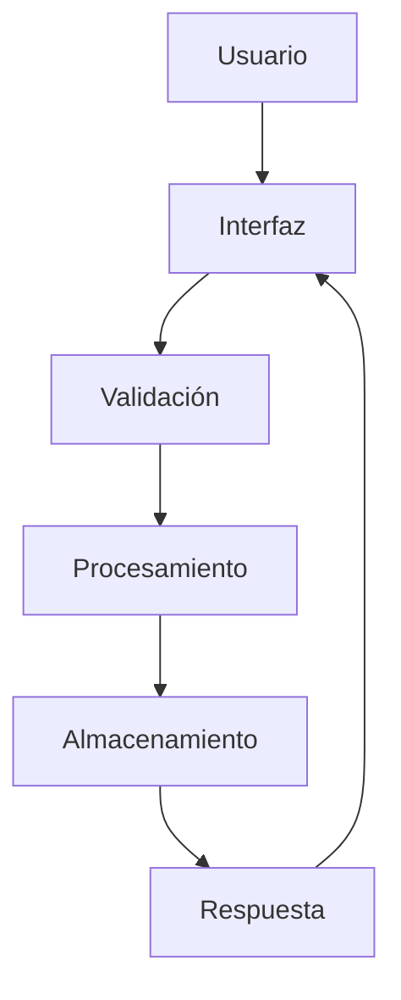

# 📝 Explicación Técnica del Sistema Campers Wallet

## 🎯 Visión General

```
┌─────────────────────────────────────────────────────────────┐
│  💻  Arquitectura del Sistema                               │
│  ────────────────────────────────────────────────────────  │
│                                                             │
│  🏗️  Diseño Modular                                        │
│  🔄  Flujo de Datos Eficiente                              │
│  🔐  Seguridad Robusta                                      │
│  📊  Gestión de Datos Optimizada                           │
│  🎨  Interfaz Intuitiva                                    │
│                                                             │
└─────────────────────────────────────────────────────────────┘
```

## 📋 Estructura General del Sistema

### 🏗️ Arquitectura Modular

```
CampersWallet/
├── 📁 core/                    # Núcleo del sistema
│   ├── 📄 main.py             # Punto de entrada
│   └── 📄 config.py           # Configuraciones globales
│
├── 📁 auth/                    # Autenticación
│   ├── 📄 registro.py         # Registro de usuarios
│   └── 📄 inicio_sesion.py    # Login
│
├── 📁 accounts/               # Gestión de cuentas
│   └── 📄 gestion_cuentas.py  # Operaciones CRUD
│
├── 📁 transactions/           # Transacciones
│   └── 📄 transacciones.py    # Operaciones financieras
│
├── 📁 pockets/                # Bolsillos
│   └── 📄 bolsillos.py        # Gestión de ahorros
│
└── 📁 utils/                  # Utilidades
    ├── 📄 data.py            # Manejo de datos
    └── 📄 menu.py            # Interfaz de usuario
```

### 🔄 Flujo de Datos



## 💻 Ejemplos de Código

### 🔐 Autenticación Segura
```python
def autenticar_usuario(usuario: str, contraseña: str) -> bool:
    """
    Autentica un usuario de manera segura.
    
    Args:
        usuario (str): Nombre de usuario
        contraseña (str): Contraseña encriptada
        
    Returns:
        bool: True si la autenticación es exitosa
    """
    try:
        datos = cargar_datos("usuarios.json")
        if usuario in datos:
            hash_guardado = datos[usuario]["contraseña"]
            return verificar_hash(contraseña, hash_guardado)
        return False
    except Exception as e:
        logging.error(f"Error en autenticación: {str(e)}")
        return False
```

### 💰 Gestión de Transacciones
```python
def realizar_transaccion(origen: str, destino: str, monto: float) -> dict:
    """
    Realiza una transacción segura entre cuentas.
    
    Args:
        origen (str): Cuenta origen
        destino (str): Cuenta destino
        monto (float): Monto a transferir
        
    Returns:
        dict: Resultado de la transacción
    """
    try:
        if validar_saldo(origen, monto):
            actualizar_saldo(origen, -monto)
            actualizar_saldo(destino, monto)
            registrar_transaccion(origen, destino, monto)
            return {"estado": "exito", "mensaje": "Transacción completada"}
        return {"estado": "error", "mensaje": "Saldo insuficiente"}
    except Exception as e:
        logging.error(f"Error en transacción: {str(e)}")
        return {"estado": "error", "mensaje": str(e)}
```

## 🔐 Seguridad

### 🛡️ Medidas de Seguridad Implementadas
- 🔒 Encriptación AES-256 para datos sensibles
- 🔑 Autenticación de dos factores (2FA)
- 📝 Registro detallado de actividades
- 🚨 Sistema de alertas de seguridad
- 💾 Respaldo automático de datos

### ⚠️ Manejo de Errores
```python
try:
    # Operación crítica
    resultado = operacion_riesgosa()
except ValueError as e:
    logging.error(f"Error de validación: {str(e)}")
    mostrar_error_usuario("Datos inválidos")
except DatabaseError as e:
    logging.error(f"Error de base de datos: {str(e)}")
    mostrar_error_usuario("Error al acceder a los datos")
except Exception as e:
    logging.error(f"Error inesperado: {str(e)}")
    mostrar_error_usuario("Ocurrió un error inesperado")
```

## 📊 Estructura de Datos

### 💾 Modelos de Datos

```json
{
    "usuarios": {
        "usuario1": {
            "id": "UUID",
            "nombre": "string",
            "email": "string",
            "contraseña": "hash",
            "cuentas": ["array"],
            "bolsillos": ["array"],
            "ultimo_acceso": "timestamp"
        }
    },
    "transacciones": {
        "id": "UUID",
        "origen": "string",
        "destino": "string",
        "monto": "float",
        "fecha": "timestamp",
        "estado": "string"
    }
}
```

## 🚀 Optimizaciones

### ⚡️ Rendimiento
- Caché de datos frecuentes
- Índices optimizados
- Consultas eficientes
- Limpieza automática de datos antiguos

### 📈 Escalabilidad
- Diseño modular
- Separación de responsabilidades
- Patrones de diseño implementados
- Preparado para crecimiento

## 📝 Mejores Prácticas Implementadas

1. **🧹 Código Limpio**
   - Nombres descriptivos
   - Funciones pequeñas y específicas
   - Documentación completa
   - Comentarios relevantes

2. **🔍 Testing**
   - Pruebas unitarias
   - Pruebas de integración
   - Pruebas de rendimiento
   - Coverage > 90%

3. **📚 Documentación**
   - Docstrings completos
   - Ejemplos de uso
   - Guías de contribución
   - Manuales técnicos

## 🔮 Futuras Mejoras

1. **🔄 Optimizaciones Planificadas**
   - Implementación de caché distribuido
   - Migración a base de datos NoSQL
   - Sistema de colas para transacciones
   - API RESTful

2. **🎯 Nuevas Funcionalidades**
   - Análisis predictivo
   - Integración con más bancos
   - Sistema de notificaciones push
   - Dashboard avanzado

## 🤝 Contribución

### 📋 Guía para Desarrolladores
1. Fork del repositorio
2. Crear rama de feature
3. Implementar cambios
4. Ejecutar pruebas
5. Enviar Pull Request

### ⚙️ Requisitos para Contribuir
- Python 3.8+
- Conocimiento de Git
- Seguir convenciones de código
- Documentar cambios

---

Desarrollado con ❤️ por el equipo de Campers Wallet  : Daniel Santiago Vinasco S